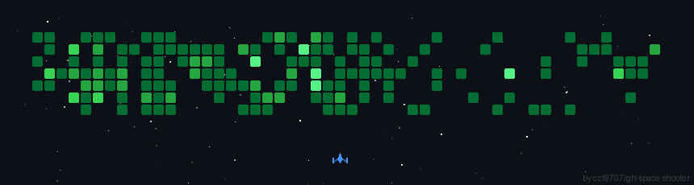

# Hi, I'm Adolph Gasper 👋 🏊🚴🏃 💻

I'm the **CEO and solo founder of - <a href="https://adoschool.com">Adoschool</a></b>**, and I'm passionate about **backend technologies** and everything related to the cloud, especially **AWS**.
I currently live in **Dar es Salaam, Tanzania** and am actively building products for other businesses and companies as an external vendor.
I share my love for technology through my portfolio site <a href="https://adolphmapunda.vercel.app">adolphmapunda.vercel.app</a></b>.

## 🌎 Find me around the web 
- Sharing updates on <a href="https://www.linkedin.com/in/adolph-gasper-106474178/">LinkedIn</a> 💼
- My site: <a href="https://adolphmapunda.vercel.app" target="_blank">adolphmapunda.vercel.app</a>

## ✨ Current situation

- ☁️ I work as an Adoschool Technical Lead at [Adoschool](https://adoschool.com/)
- 🤓 I am the CEO and Solo-founder of [Adoschool](https://www.adoschool.com), an indie company that helps schools automate everyday activities
- 🌱 I’m currently learning the AWS Cloud course, Angular, and Go
- 📝 I am writing a tool that will revolutionize how schools in Tanzania operate and fill the gap between schools and goverment

## GitHub Space Shooter

## 👨🏻‍💻 Programming Languages

  
  
  
  
  
  
  

## 💻 Framework and Libraries

  
  
  
  
  
  
  
  

## ☁️ Cloud Services

   
  
  
  
  

## 💾 Databases

  
  
  
  

## ⚙️ IDE & Editors

  
  

## 🔨 Productivity Tools

  
  

## 🦾 Tools

  
  

## 📈 GitHub Stats

 
[ 

## 🏆GitHub Trophies

  

## 📝 Blog posts
<!-- BLOG-POST-LIST:START -->
- [GitHub Copilot to Generate Conventional Commit Messages in VSCode and JetBrains Rider](https://dev.to/playfulprogramming/github-copilot-to-generate-conventional-commit-messages-in-vscode-and-jetbrains-rider-1n3b)
- [A Practical GitFlow Setup That Works on GitHub](https://dev.to/playfulprogramming/a-practical-gitflow-setup-that-works-on-github-46lb)
- [How I created a Cozy Workspace in VS Code](https://dev.to/playfulprogramming/how-i-created-a-cozy-workspace-in-vs-code-4bf0)
- [Why I Built TaskDeck and How It Improves Your VS Code Workflow](https://dev.to/playfulprogramming/why-i-built-taskdeck-and-how-it-improves-your-vs-code-workflow-4fk9)
- [Why I Use JetBrains Rider for .NET Development](https://dev.to/playfulprogramming/why-i-use-jetbrains-rider-for-net-development-2a8k)
<!-- BLOG-POST-LIST:END -->

## ⚡ Recent Activities

<!--START_SECTION:activity-->
1. 🚀 Published release [v1.0.0](https://github.com/kasuken/copilot-devpersona/releases/tag/v1.0.0) in [kasuken/copilot-devpersona](https://github.com/kasuken/copilot-devpersona)
2. ℹ️ Unassigned issue [#1](https://github.com/kasuken/LearnStack/issues/1) in [kasuken/LearnStack](https://github.com/kasuken/LearnStack)
3. ℹ️ Labeled issue [#2](https://github.com/kasuken/LearnStack/issues/2) in [kasuken/LearnStack](https://github.com/kasuken/LearnStack)
4. ❗ Opened issue [#2](https://github.com/kasuken/LearnStack/issues/2) in [kasuken/LearnStack](https://github.com/kasuken/LearnStack)
5. ℹ️ Assigned issue [#1](https://github.com/kasuken/LearnStack/issues/1) in [kasuken/LearnStack](https://github.com/kasuken/LearnStack)
<!--END_SECTION:activity-->

## 💰You can help me by donating
    

## 💌 Contact Me

---

 © 2025 Emanuele Bartolesi, all rights reserved. Made with ❤️. 

https://www.emanuelebartolesi.com

